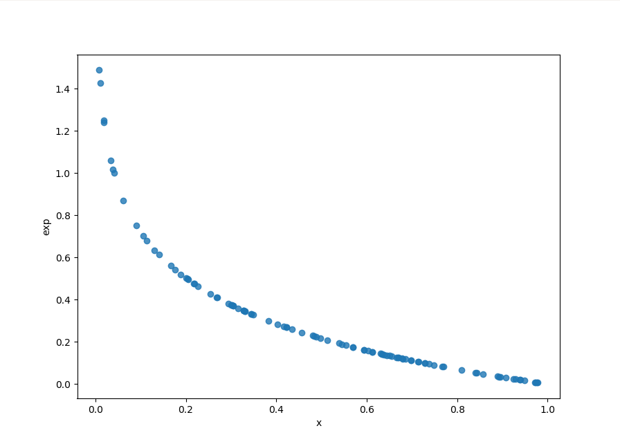
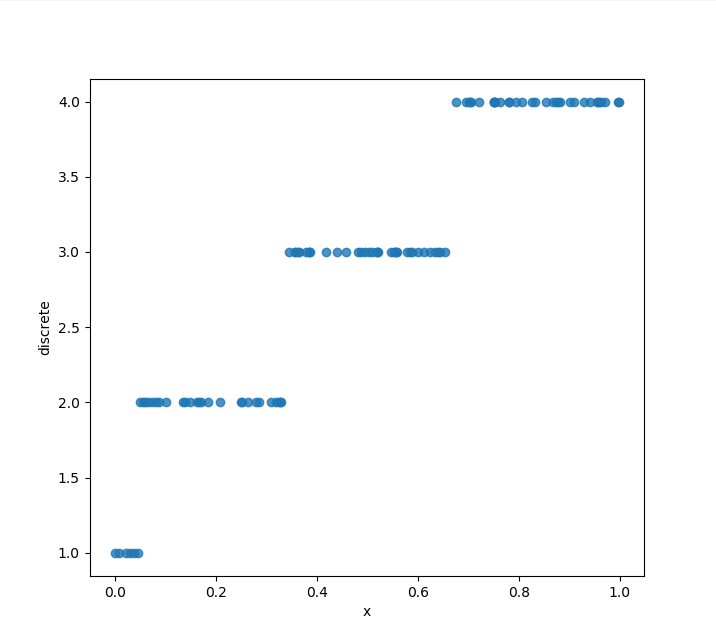

### Константи:

- <code>&lambda; = 16&frasl;5</code>
- `i = 1`
- `j = 6`
- `k = 7`
- `l = 7`

### Exp

Формальні показники(за формулами):
- M = 0.3125
- D = 0.09765...

Фактичні(числові):
- M = 0.2952...
- D = 0.0987...

### Discrete

Формальні показники(за формулами):
- M = 2.9523...
- D = 0.80725...

Фактичні(числові):
- M = 3.04
- D = 0.7584