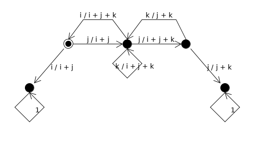

# Лабораторная работа 1
Токарев Павел, МФ-31, 15.03.2018

## Формулировка

Есть цепь Маркова, вероятности которой зависят от параметров `i`, `j`, `k`. Обозначения состояний слева направо: Река, Левая нога, На двух ногах, Правая нога, Копья. Начальным состоянием является левая нога(оно особенное на картинке).

Используя эту цепь, выяснить:
1. среднее время до попадания в невозвратное состояние;
2. вероятность упасть;
3. просимулировать работу цепи и вычислить метрики выше для симуляции и сравнить с теоретическими данными.

## Параметры

- `i` &mdash; 7;
- `j` &mdash; 7;
- `k` &mdash; 5;
- количество симуляций &mdash; 10 000.

## Результаты

- Р - река;
- К - копья;
- Л - на левой ноге;
- С - на двух ногах;
- П - на правой ноге.

### Матрицы
#### P

|   | Р | К | Л | С | П |
|---|---|---|---|---|---|
| Р | 1.00000| 0.00000| 0.00000| 0.00000| 0.00000|
| К | 0.00000| 1.00000| 0.00000| 0.00000| 0.00000|
| Л | 0.50000| 0.00000| 0.00000| 0.50000| 0.00000|
| С | 0.00000| 0.00000| 0.36842| 0.26316| 0.36842|
| П | 0.00000| 0.58333| 0.00000| 0.41667| 0.00000|

#### N = (E - Q)^-1
Среднее время пребывания в состоянии <code>Sj</code> если начинаем в <code>Si</code>(то есть среднее количество раз когда это состояние будет посещено до того, как попадем в состояние поглощения).

|<code>i\\j</code>| Л | С | П |
|---|---|---|---|
| Л | 1.46154| 1.25275| 0.46154|
| С | 0.92308| 2.50549| 0.92308|
| П | 0.38462| 1.04396| 1.38462|

#### B = N*R

Вероятность поглотится в состоянии <code>Sj</code> если начинаем в <code>Si</code>.

|<code>i\\j</code>| Р | К |
|---|---|---|
| Л | 0.73077| 0.26923|
| С | 0.46154| 0.53846|
| П | 0.19231| 0.80769|

### Среднее время устоять:

| Метод         | На левой | На обеих | На правой | Среднее средних |
|---------------|----------|----------|-----------|------|
| теоретический |    1.46154    |    1.25275    |    0.46154     |    1.0586080586080584   |  
| практический  |    1.45310    |    1.24530    |    0.47210     |   1.0568333333333333    |

### Вероятность упасть в/на:

| Метод         | Реку     | Копья    | Сумма |
|---------------|----------|----------|-------|
| теоретический | 0.73077   | 0.26923   | 1.0    |
| практический  | 0.72470   | 0.27530   | 1.0    |
