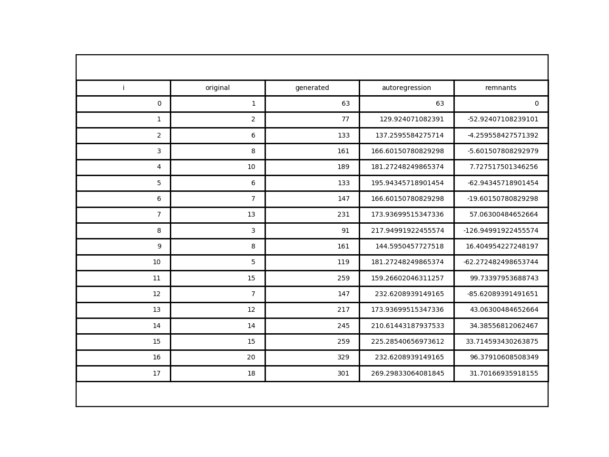
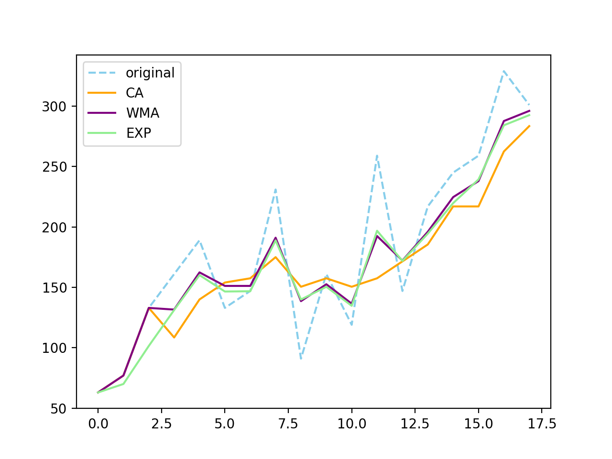
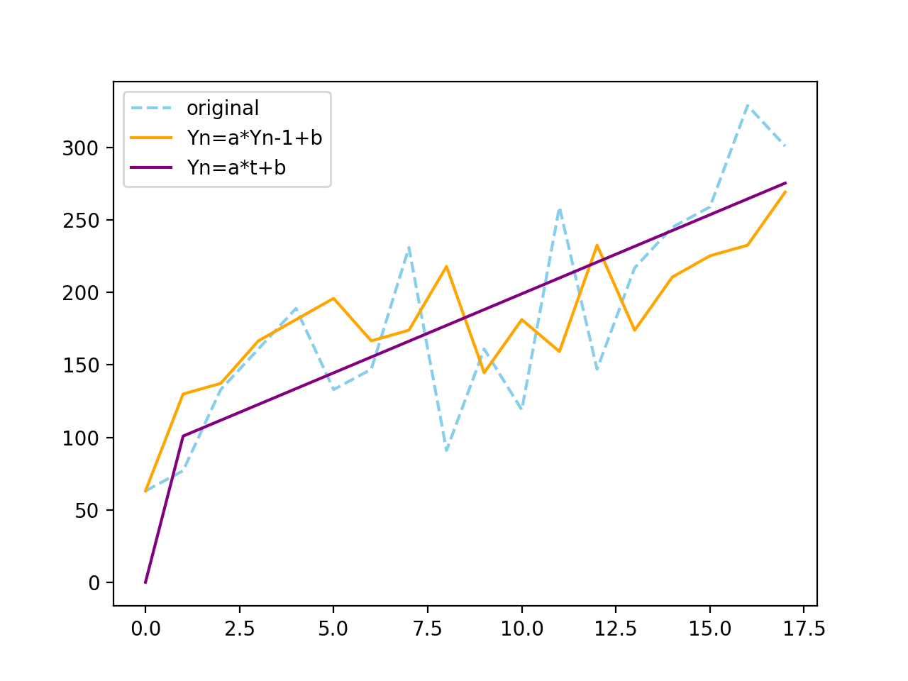
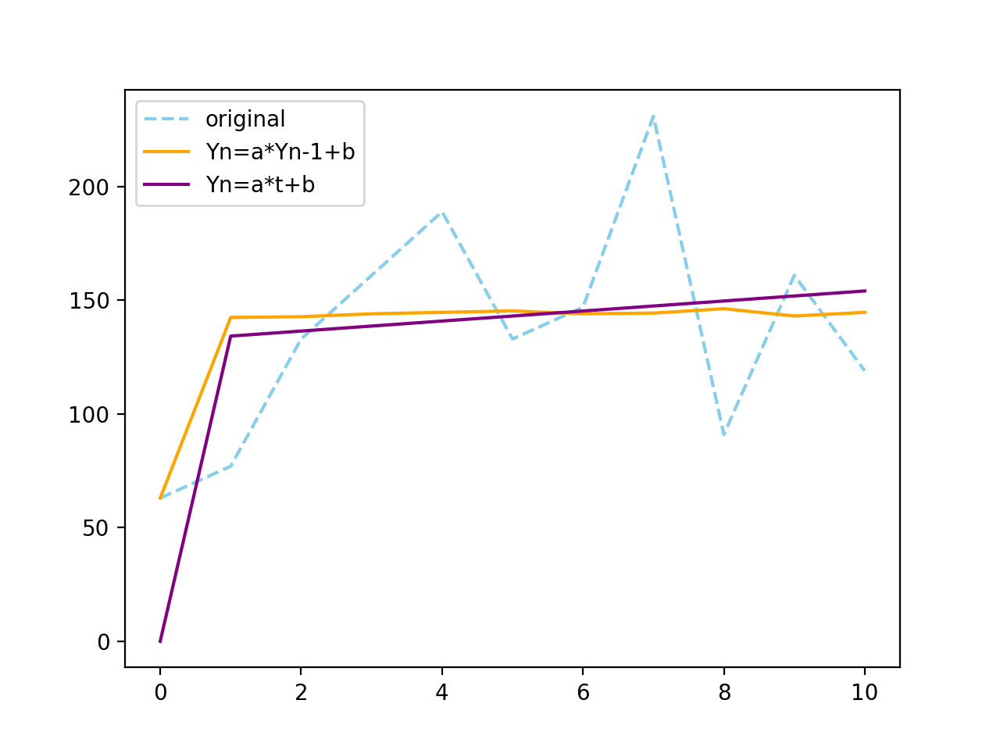

# Случайные процессы. Лабораторные 4-5
Токарев Павел, МФ-31

## Параметры:

- $i = 7$,
- $j = 7$,
- $\alpha = \frac{1}{2}$.

## Задачи:
- дан временной ряд, преобразовать его в новый ряд по формуле 
$$y_{i} = (i+j)x_i+(i-j)^2+ij \,\,(1)\,,$$
- полученный временной ряд сгладить с помощью скользящего среднего(`CA`) 
$$y_n = \frac{x_n+x_{n-1}+x_{n-2}+x_{n-3}}{4} \,\,(2)\,,$$
 весового скользящего среднего(`WMA`) 
 $$ y_n = 0.4\,x_n+0.3\,x_{n-1}+0.2\,x_{n-2}+0.1\,x_{n-3} \,\,(3)$$
  и экспоненциального скользящего среднего (`ExpA`)
  $$ \hat{y}_n = \alpha\,y_{n-1} + (1-\alpha)\hat{y}_{n-1} \,\,(4)\,,$$
- найти коэффициенты для авторегрессионных моделей 
$$y_n = a\,y_{n-1} + b \,\,(5)$$ и $$y_n = a\,t_{n-1} + b \,\,(6)\,,$$ по оценочным формулам
$$a^* = \frac{\bar{xy}-\bar{x}\bar{y}}{\bar{x^2} - (\bar{x})^2} \,\,(7)\,,$$
$$b^* = \bar{y} - a^*\,\bar{x}\,\,(8)\,,$$
 используя модель построить спрогнозированный ряд, вычислить коэффициент регрессии
  
  
 $$r_1 = \frac{\bar{xy}-\bar{x}\bar{y}}{\sigma_x\sigma_y} \,\,(9)\,,$$
- построить графики.

## Данные

 
 
 
 
 
 

## Результаты
### Графики скользящего сглаживания

### Авторегрессия по предыдущему

- $a = 0.52396$,
- $b = 96.914$,
- $r_1 = 0.75144$.

### Авторегрессия по времени

- $a = 10.912$,
- $b = 100.88$,
- $r_1 = 0.026159$.

### Авторегрессия по предыдущему (первая половина)

- $a = 0.022876$,
- $b = 141.03$,
- $r_1 = 0.026159$.

### Авторегрессия по времени (первая половина)

- $a = 2.2061$,
- $b = 134.27$,
- $r_1 = 0.14794$.

### График авторегрессий по всему ряду

### График авторегрессий по половине ряда

